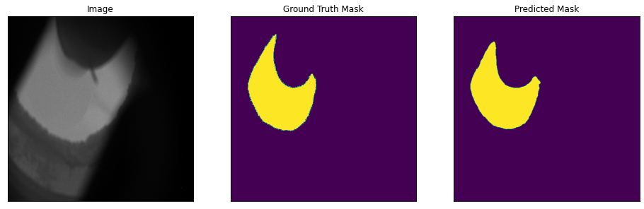
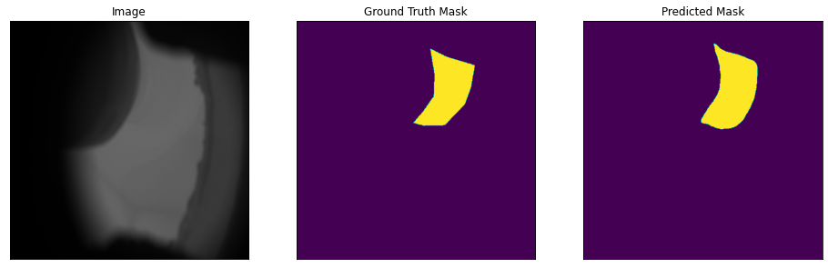
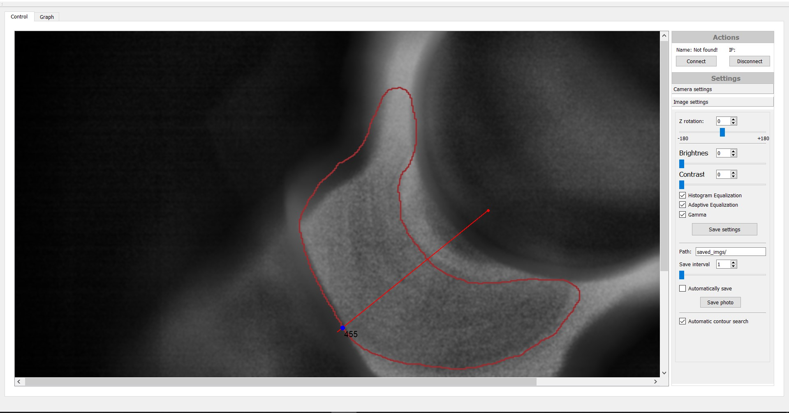

# sapphireSegmentation
В данном репозитории содержится пример обучения нейронной сети для сегментации, которая является частью системы автоматизированного выращивания кристаллов сапфира.

## Описание задачи
Процесс выращивания искусственного сапфира состоит из нескольких этапов: 
* в расплав помещают специально кристаллизованный объект - затравку, на которой будет расти новый кристалл;
* стабилизируется скорость роста кристалла и скорость поднятия затравки из раствора;
* собственно сам процесс роста кристалла.

Основной проблем такого тех. процесса является второй пункт, так как от правильного расчета скорости поднятия затравки зависит качество и размер получаемого кристалла.
Скорость поднятия на прямую зависит от скорости роста (радиуса) кристалла. Однако в большинстве случаев радиус кристалла определяется аппаратчиками на глаз, что значительно уменьшает точность и увеличивает время стабилизации процесса.

## Решение
Основными требованиями к разрабатываемой системе являются точность определения радиуса, и не высокие требования к вычислительным мощностям. На время подсчета радиуса строгих ограничений не накладывается, так как процесс роста кристалла очень инерционен.

Процесс стабилизации роста может быть оптимизирован при помощи технического зрения, достаточно определять контур кристалла на изображении и высчитывать радиус. В данном проекте рассматривается проблема определения контура с помощью нейронных сетей для сегментации.

В качестве фреймворка глубокого обучения выбран Pytorch. Решение основано на моделях из пакета segmentation_models_pytorch. Было размечено около 4000 экземпляров изображений различных этапов роста кристалла.

В качестве сегментационной сети выбрана DeepLabv3+. Для расширения выборки были использованы методы аугментации данных, такие как: поворот, масштабирование, обрезка, размытие, изменение контраста и гаммы. Обучение сети позволило достичь метрики IoU 0.7796, на тестовых данных IoU составило 0.7804. Пример предсказания сети показан ниже.

    
    

 

## Результаты
Была получена удовлетворительная точность предсказания контура кристалла. Полученная нейронная сеть может быть использована в качестве функционального узла системы автоматизированного выращивания кристаллов сапфира.

    

 

